# 架构时序与数据流图册（Review 稿）

| 项目 | 内容                                                              |
| -- | --------------------------------------------------------------- |
| 状态 | **待评审**                                                         |
| 日期 | 2026-11-15                                                      |
| 用途 | 用图 review 整体架构：进程怎么连、数据怎么流、每一步失败会怎样                             |
| 关系 | [系统架构与数据流全景](系统架构与数据流全景.md) 是**表格速览**，本册是**图形细节**；两者冲突时以 ADR 为准 |


---

## 0. 怎么用

- 只想知道"有哪些进程"→ §1、§2；
- 想验证"数据从哪来到哪去"→ §3（4 张数据流图）；
- 想验证"某条链路怎么走、失败怎么办"→ §4（13 张时序图）；
- 想验证"整个系统串起来是否自洽"→ §5（端到端串演，一张图跨 11 个进程）。

图例：实线箭头 = 同步调用；虚线箭头 = 异步/推送；`Note` = 关键切换点。

---

## 1. 全局进程交互图（单控制面 · ≤10,000 节点）

> 本节是**基线规模**（PRD 的 20 集群 / 500 节点，上限 10,000）。**100,000 节点的分片形态见 §1.1**——那是另一张图，不是把这张放大。

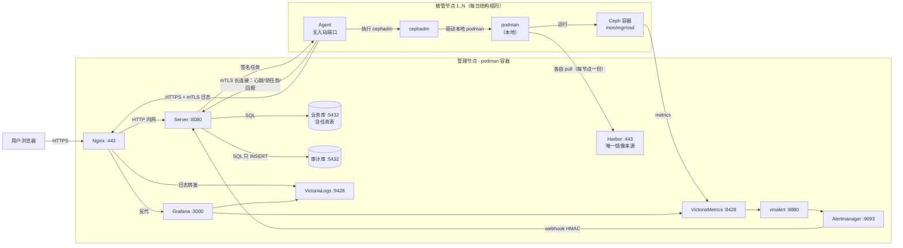
```mermaid
graph LR
  U["用户浏览器"]

  subgraph M["管理节点 · podman 容器"]
    NG["Nginx :443"]
    S["Server :8080"]
    PG[("业务库 :5432<br/>含任务表")]
    ADB[("审计库 :5432")]
    HR["Harbor :443<br/>唯一镜像来源"]
    VM["VictoriaMetrics :8428"]
    VL["VictoriaLogs :9428"]
    VMA["vmalert :8880"]
    AM["Alertmanager :9093"]
    GF["Grafana :3000"]
  end

  subgraph N["被管节点 1..N（每台结构相同）"]
    A["Agent<br/>无入站端口"]
    CM["cephadm"]
    PD["podman<br/>（本地）"]
    CE["Ceph 容器<br/>mon/mgr/osd"]
  end

  U -->|HTTPS| NG
  NG -->|HTTP 内网| S
  NG -->|反代| GF
  NG -->|日志转发| VL
  S -->|SQL| PG
  S -->|SQL 只 INSERT| ADB
  A -->|"mTLS 长连接：心跳/领任务/回报"| S
  S -->|签名任务| A
  A -->|"HTTPS + mTLS 日志"| NG

  A -->|"执行 cephadm"| CM
  CM -->|"驱动本地 podman"| PD
  PD -->|"各自 pull（每节点一份）"| HR
  PD -->|运行| CE
  CE -->|metrics| VM
  VM --> VMA
  VMA --> AM
  AM -->|webhook HMAC| S
  GF --> VM
  GF --> VL
```

**镜像那条链要单独看**：`Agent → 本机 cephadm → 本机 podman → Harbor`。Harbor 是唯一来源，但**每个节点各拉一份**——N 台节点就是 N 条出站放行、N 份并发、N 个失败点。cephadm 只是「驱动者」，真正建连接的是本机 podman（这也是为什么 Agent 自己不需要 Harbor 凭据）。

**五个非对称点**（评审重点，都是最容易画错的地方）：

| 非对称                       | 原因                       |
| ------------------------- | ------------------------ |
| **Agent 无入站端口**，只有出站 | 拉模式；节点上不开监听，扫描扫不到 |
| **Agent 不连 Harbor**：`Agent → 本机 cephadm → 本机 podman → Harbor` | Agent 只是命令触发器；真正建连接的是本机 podman，所以 Agent 不需要 Harbor 凭据（ADR-30） |
| **Harbor 是唯一来源，但每台节点各自拉** | N 台 = N 条放行、N 份并发、N 个失败点；`image_pull_failed` 必须定位到节点 |
| **Server 不碰 Ceph**（无 mgr REST / cephadm / CLI） | 只有 Agent 能触达节点与 Ceph，信任边界只有一层（ADR-35） |
| Grafana 只能经 Nginx | 直连会绕过 RBAC，viewer 能看任意集群 |

---

## 1.1 大规模形态：100,000 节点（20 片 × 2 对等副本）

> 来源：[ADR-38](ADR-38-Agent通信分片.md)。**只改「Agent 怎么连、任务怎么找到连接」，其他组件形态不变。**

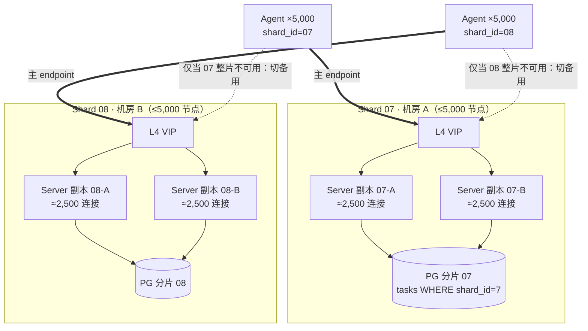
```mermaid
graph TB
  subgraph SH07["Shard 07 · 机房 A（≤5,000 节点）"]
    V7["L4 VIP"]
    R7A["Server 副本 07-A<br/>≈2,500 连接"]
    R7B["Server 副本 07-B<br/>≈2,500 连接"]
    D7[("PG 分片 07<br/>tasks WHERE shard_id=7")]
    V7 --> R7A
    V7 --> R7B
    R7A --> D7
    R7B --> D7
  end

  subgraph SH08["Shard 08 · 机房 B（≤5,000 节点）"]
    V8["L4 VIP"]
    R8A["Server 副本 08-A<br/>≈2,500 连接"]
    R8B["Server 副本 08-B<br/>≈2,500 连接"]
    D8[("PG 分片 08")]
    V8 --> R8A
    V8 --> R8B
    R8A --> D8
    R8B --> D8
  end

  AG7["Agent ×5,000<br/>shard_id=07"]
  AG8["Agent ×5,000<br/>shard_id=08"]

  AG7 ==>|"主 endpoint"| V7
  AG8 ==>|"主 endpoint"| V8
  AG7 -.->|"仅当 07 整片不可用：切备用"| V8
  AG8 -.->|"仅当 08 整片不可用：切备用"| V7
```

**三个要点**：

| 要点 | 为什么 |
| --- | --- |
| Agent **静态归属**一片（交付期写入 `shard_id` + 主 endpoint + 2 个备用） | 免掉注册中心的强依赖；任务路由天然收敛到片内 |
| 每片 **2 个对等副本**，不是主备 | 主备切主要重连 5,000 条；对等只重连 2,500 条，且没有「切换」动作 |
| **备用 endpoint 不得指向同片** | 否则片级故障时全部回连到同一处，形成二次风暴 |

**规模算式**：100,000 ÷ 5,000 = **20 片**；× 2 副本 = **40 个 Server 进程**；每副本 ≈2,500 连接 ≈250MB。

### 1.2 任务怎么找到那条连接

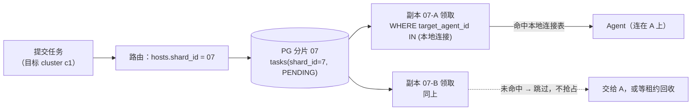
```mermaid
flowchart LR
  T["提交任务<br/>（目标 cluster c1）"] --> RT["路由：hosts.shard_id = 07"]
  RT --> Q[("PG 分片 07<br/>tasks(shard_id=7, PENDING)")]
  Q --> LA["副本 07-A 领取<br/>WHERE target_agent_id IN (本地连接)"]
  Q --> LB["副本 07-B 领取<br/>同上"]
  LA -->|"命中本地连接表"| A["Agent（连在 A 上）"]
  LB -.->|"未命中 → 跳过，不抢占"| N["交给 A，或等租约回收"]
```

**这条链是全部分片设计的收益所在**：`shard_id` 把候选任务从「40 个进程共享的一张大表」缩到「本片 2 个副本的一小块」，再用「本地连接表」把范围缩到「我确实能推到的 Agent」。**没有跨副本转发，没有路由表。**

> 协议细节（消息字段、错误码、握手与迁移语义）见 [Agent-Server 通信协议](../03-开发工程师/Agent-Server通信协议.md)。

---

## 1.3 怎么部署：一片 = 一整套小平台

> §1.1 画的是逻辑关系，容易误读成「把 Server 切开」。**实际做法是「把整套平台复制 20 份」**，每份只服务自己那 5,000 台。

### 1.3.1 物理视角（一个片）

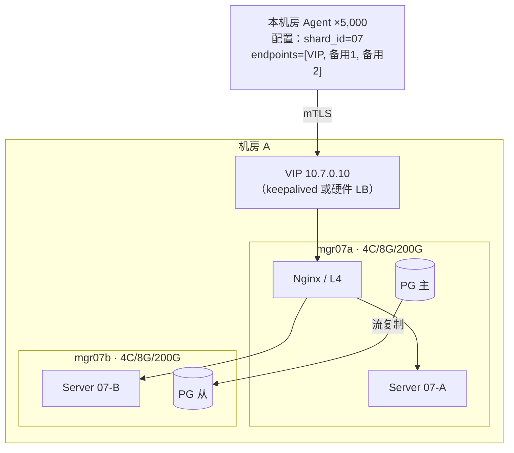
```mermaid
graph TB
  subgraph DC["机房 A"]
    subgraph M1["mgr07a · 4C/8G/200G"]
      N1["Nginx / L4"]
      S1["Server 07-A"]
      P1[("PG 主")]
    end
    subgraph M2["mgr07b · 4C/8G/200G"]
      S2["Server 07-B"]
      P2[("PG 从")]
    end
    VIP["VIP 10.7.0.10<br/>（keepalived 或硬件 LB）"]
    VIP --> N1
    N1 --> S1
    N1 --> S2
    P1 -->|流复制| P2
  end
  AG["本机房 Agent ×5,000<br/>配置：shard_id=07<br/>endpoints=[VIP, 备用1, 备用2]"]
  AG -->|mTLS| VIP
```

**要点**：

| 项 | 说明 |
| --- | --- |
| 一个片 = **2 台管理机** | 两台分别跑 Server 副本 A/B 与 PG 主/从，跨机架摆放 |
| VIP 是入口 | keepalived 或客户现有 LB；Agent 只认 VIP，不认单机 IP |
| 片之间**没有任何运行时依赖** | 不共享数据库、不共享连接、不互相调用 |
| 片内自带数据面 | 本片 PG 只存本片的 hosts / tasks（`shard_id` 恒等于本片） |

### 1.3.2 三步上线

| 步 | 做什么 | 产物 |
| --- | --- | --- |
| ① 规划 | 建一张分片表：`shard_id → 机房 → VIP → 节点范围 → 备用片` | `deploy/shards.yaml`（或 CMDB 导出） |
| ② 逐片部署 | 每片一套 inventory 与 group_vars，跑一次 `deploy.sh` | `inventory/shard-07` + `group_vars/shard-07.yml` |
| ③ 节点归属 | 装 Agent 时把 `shard_id` 与 3 个 endpoint 写进本地配置 | `/etc/winter-agent/config.yaml` |

```yaml
# deploy/group_vars/shard-07.yml（每片一份，只有参数不同）
shard:
  id: 7
  vip: 10.7.0.10
  endpoints:                 # 主 + 2 个备用，备用必须来自其他片
    - 10.7.0.10
    - 10.11.0.10             # 片 11（异地）
    - 10.15.0.10             # 片 15（异地）
  db_primary: mgr07a
  db_replica: mgr07b
  harbor: harbor-a.local     # 本机房 Harbor 缓存（镜像 150TB 问题的落点）
```

### 1.3.3 扩容与迁移

| 场景 | 做法 |
| --- | --- |
| 某机房超过 5,000 台 | 新增一个片（2 台机器 + 部署），把超出的节点改归属到新片 |
| 改归属 | Server 下发 `REDIRECT{target_shard_id, new_endpoints[]}`；Agent **持久化新配置**后迁移 |
| 迁移期间 | draining：不领新任务、完成在途、宽限 300s、限速 50 次/s/片 |
| 超时兜底 | 到期没连上 → 回退旧片，节点不变砖 |

### 1.3.4 代价（必须认）

| 项 | 数量 |
| --- | --- |
| 管理机 | 20 片 × 2 台 = **40 台**（4C/8G，约 160C/320G） |
| 数据库 | **20 套 PG**（各自主从、各自备份） |
| 控制台 | 默认 **20 个**入口；要「一处看全部」必须另做全局视图层（不在本图范围） |
| 观测 | 每片（或每机房）一套 VM/VL，否则 10 万节点指标会把单实例打爆 |

**一句话**：100k 规模不是「一台更强的 Server」，而是「40 台普通 Server + 20 套独立平台」。用机器数量换掉单点的规模上限。

---

## 2. 进程交互矩阵

发起方（行）→ 接收方（列）：

| 从 ＼ 到 | Nginx | Server | PG | 审计库 | Agent | Ceph | VM | VL | AM | Harbor |
| --- | --- | --- | --- | --- | --- | --- | --- | --- | --- | --- |
| 浏览器 | HTTPS | — | — | — | — | — | — | — | — | — |
| Nginx | — | HTTP | — | — | — | — | — | 日志 | — | — |
| Server | — | — | SQL | SQL | 签名任务 | — | 查询 | — | — | — |
| Agent | 日志 | mTLS | — | — | — | — | — | — | — | — |
| cephadm / podman | — | — | — | — | — | 运行容器 | metrics | — | — | **pull（每节点）** |
| vmalert | — | — | — | — | — | — | 查询 | — | 告警 | — |
| Alertmanager | — | webhook | — | — | — | — | — | — | — | — |
| Grafana | — | — | — | — | — | — | 查询 | 查询 | — | — |

### 2.1 每个进程的进出清单

| 进程              | 入站（谁 → 它：什么）                | 出站（它 → 谁：什么）                            | 触发时机       |
| --------------- | --------------------------- | --------------------------------------- | ---------- |
| Nginx           | 浏览器：页面/API；Agent：日志         | Server：转发；Grafana：反代；VL：写入              | 持续         |
| Server          | Nginx：API；Agent：心跳/回报；AM：告警 | PG（含任务队列）/ 审计库 / VM（查询）              | 持续         |
| Agent           | Server：签名任务                 | Server：心跳/结果；Nginx：日志；本机 cephadm：执行 | 持续（30s 心跳） |
| 本机 cephadm / podman | Agent：调起 | Ceph：运行容器；Harbor：**各自 pull 镜像**（每节点一份） | 部署/升级/扩容 |
| 业务库             | Server                      | —                                       | 持续         |
| 审计库             | Server（只 INSERT）            | —                                       | 每次写操作      |
| Harbor          | 制包机、节点、cephadm              | —                                       | 部署/升级      |
| VictoriaMetrics | 采集端                         | vmalert、Grafana、Server                  | 持续         |
| VictoriaLogs    | Nginx                       | Grafana、Server                          | 持续         |
| vmalert         | VM                          | Alertmanager                            | 规则求值周期     |
| Alertmanager    | vmalert                     | Server                                  | 告警触发       |
| Grafana         | Nginx                       | VM、VL                                   | 用户打开面板     |

---

## 3. 数据流图（DFD）

### 3.1 控制面：请求 → 任务 → 执行

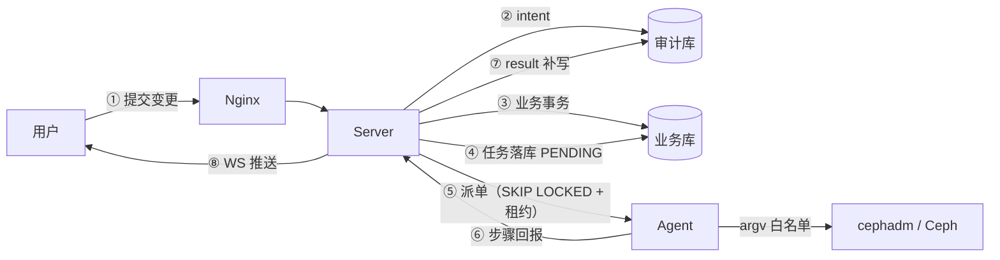
```mermaid
flowchart LR
  U["用户"] -->|"① 提交变更"| NG["Nginx"]
  NG --> S["Server"]
  S -->|"② intent"| ADB[("审计库")]
  S -->|"③ 业务事务"| PG[("业务库")]
  S -->|"④ 任务落库 PENDING"| PG
  S -->|"⑤ 派单（SKIP LOCKED + 租约）"| A["Agent"]
  A -->|"argv 白名单"| CE["cephadm / Ceph"]
  A -->|"⑥ 步骤回报"| S
  S -->|"⑦ result 补写"| ADB
  S -->|"⑧ WS 推送"| U
```

### 3.2 观测面：指标、日志、告警

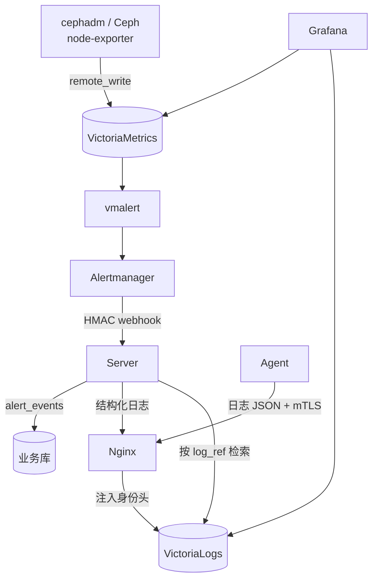
```mermaid
flowchart TB
  CE["cephadm / Ceph<br/>node-exporter"] -->|remote_write| VM[("VictoriaMetrics")]
  VM --> VMA["vmalert"]
  VMA --> AM["Alertmanager"]
  AM -->|"HMAC webhook"| S["Server"]
  S -->|"alert_events"| PG[("业务库")]
  A["Agent"] -->|"日志 JSON + mTLS"| NG["Nginx"]
  S -->|"结构化日志"| NG
  NG -->|"注入身份头"| VL[("VictoriaLogs")]
  GF["Grafana"] --> VM
  GF --> VL
  S -->|"按 log_ref 检索"| VL
```

**边界**：日志**不进 Server**（不代理字节）；指标**不进 PG**；告警进 PG 但不进审计库。

### 3.3 凭据与密钥流（此前缺图的一条）

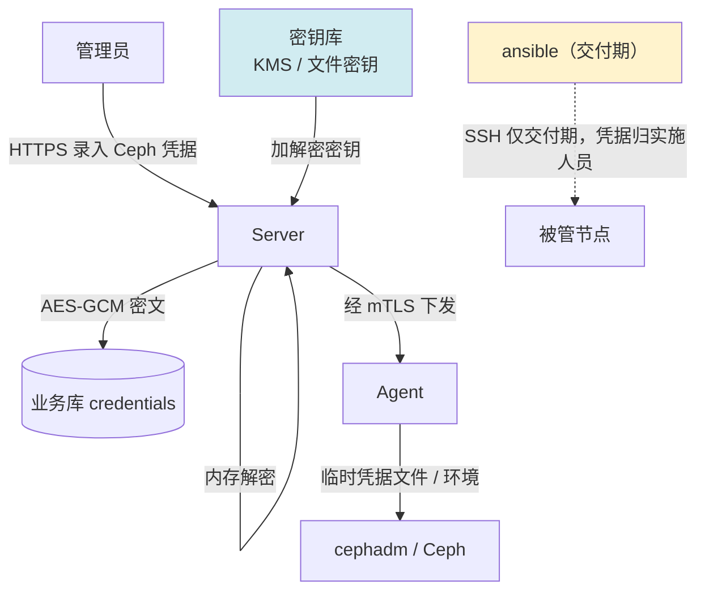
```mermaid
flowchart TB
  U["管理员"] -->|"HTTPS 录入 Ceph 凭据"| S["Server"]
  KMS["密钥库<br/>KMS / 文件密钥"] -->|"加解密密钥"| S
  S -->|"AES-GCM 密文"| PG[("业务库 credentials")]
  S -->|"内存解密"| S
  S -->|"经 mTLS 下发"| A["Agent"]
  A -->|"临时凭据文件 / 环境"| CE["cephadm / Ceph"]

  AN["ansible（交付期）"] -.->|"SSH 仅交付期，凭据归实施人员"| N["被管节点"]

  style AN fill:#fff3cd
  style KMS fill:#d1ecf1
```

**要点**：Ceph 凭据「密文入库、内存解密、只在 mTLS 通道里传」；**平台不持有 SSH 凭据**——交付期的 SSH 由实施人员执行 ansible 完成，运行期零 SSH（ADR-35）；密钥本身与备份包物理分离（ADR-31）。

### 3.4 审计流（两段式 + 链式哈希）

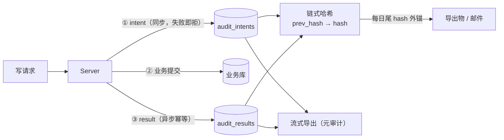
```mermaid
flowchart LR
  RQ["写请求"] --> S["Server"]
  S -->|"① intent（同步，失败即拒）"| A1[("audit_intents")]
  S -->|"② 业务提交"| PG[("业务库")]
  S -->|"③ result（异步幂等）"| A2[("audit_results")]
  A1 --> CH["链式哈希<br/>prev_hash → hash"]
  A2 --> CH
  CH -->|"每日尾 hash 外锚"| EXT["导出物 / 邮件"]
  A1 --> EXP["流式导出（元审计）"]
  A2 --> EXP
```

---

## 4. 时序图（13 条）

### 4.1 登录与会话（local / LDAP 双分支）

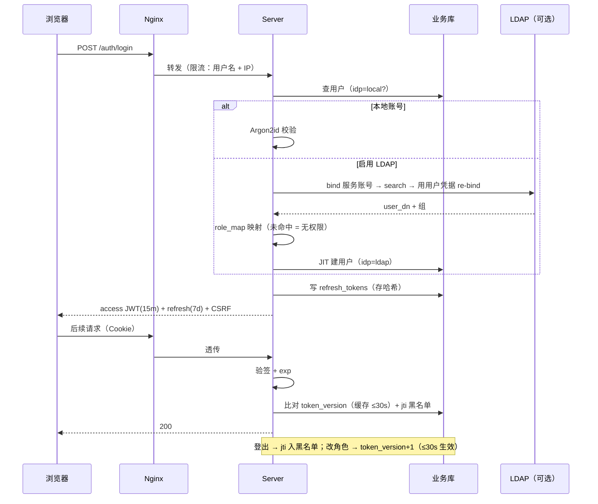
```mermaid
sequenceDiagram
    participant U as 浏览器
    participant NG as Nginx
    participant S as Server
    participant PG as 业务库
    participant L as LDAP（可选）

    U->>NG: POST /auth/login
    NG->>S: 转发（限流：用户名 + IP）
    S->>PG: 查用户（idp=local?）
    alt 本地账号
        S->>S: Argon2id 校验
    else 启用 LDAP
        S->>L: bind 服务账号 → search → 用用户凭据 re-bind
        L-->>S: user_dn + 组
        S->>S: role_map 映射（未命中 = 无权限）
        S->>PG: JIT 建用户（idp=ldap）
    end
    S->>PG: 写 refresh_tokens（存哈希）
    S-->>U: access JWT(15m) + refresh(7d) + CSRF
    U->>NG: 后续请求（Cookie）
    NG->>S: 透传
    S->>S: 验签 + exp
    S->>PG: 比对 token_version（缓存 ≤30s）+ jti 黑名单
    S-->>U: 200
    Note over S,PG: 登出 → jti 入黑名单；改角色 → token_version+1（≤30s 生效）
```

**失败分支**：LDAP 不可用 → 本地管理员仍可登录（break-glass）；密码错与用户不存在返回同一提示（防枚举）。

### 4.2 新建集群（全程 Agent）

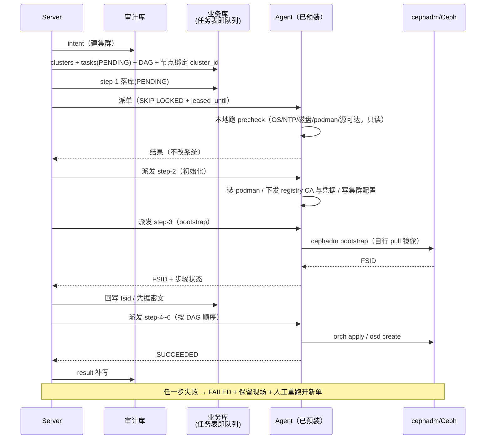
```mermaid
sequenceDiagram
    participant S as Server
    participant ADB as 审计库
    participant PG as 业务库<br/>(任务表即队列)
    participant A as Agent（已预装）
    participant CE as cephadm/Ceph

    S->>ADB: intent（建集群）
    S->>PG: clusters + tasks(PENDING) + DAG + 节点绑定 cluster_id
    S->>PG: step-1 落库(PENDING)
    S->>A: 派单（SKIP LOCKED + leased_until）
    A->>A: 本地跑 precheck（OS/NTP/磁盘/podman/源可达，只读）
    A-->>S: 结果（不改系统）
    S->>A: 派发 step-2（初始化）
    A->>A: 装 podman / 下发 registry CA 与凭据 / 写集群配置
    S->>A: 派发 step-3（bootstrap）
    A->>CE: cephadm bootstrap（自行 pull 镜像）
    CE-->>A: FSID
    A-->>S: FSID + 步骤状态
    S->>PG: 回写 fsid / 凭据密文
    S->>A: 派发 step-4~6（按 DAG 顺序）
    A->>CE: orch apply / osd create
    A-->>S: SUCCEEDED
    S->>ADB: result 补写
    Note over S,CE: 任一步失败 → FAILED + 保留现场 + 人工重跑开新单
```

**评审关注**：全程只有一个执行者（Agent），**没有任何一步走 SSH**；节点在交付期已预装并注册，纳管只是绑定 `cluster_id`（ADR-35）。

### 4.3 纳管已有集群（同一通道，两种权限档）

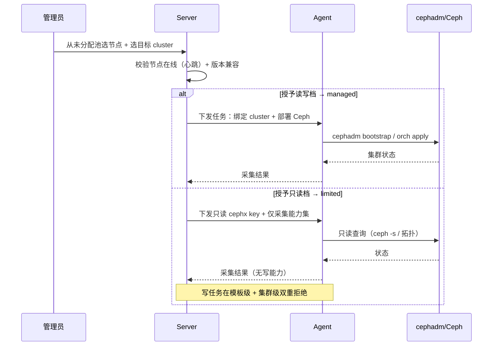
```mermaid
sequenceDiagram
    participant U as 管理员
    participant S as Server
    participant A as Agent
    participant CE as cephadm/Ceph

    U->>S: 从未分配池选节点 + 选目标 cluster
    S->>S: 校验节点在线（心跳）+ 版本兼容
    alt 授予读写档 → managed
        S->>A: 下发任务：绑定 cluster + 部署 Ceph
        A->>CE: cephadm bootstrap / orch apply
        CE-->>A: 集群状态
        A-->>S: 采集结果
    else 授予只读档 → limited
        S->>A: 下发只读 cephx key + 仅采集能力集
        A->>CE: 只读查询（ceph -s / 拓扑）
        CE-->>A: 状态
        A-->>S: 采集结果（无写能力）
        Note over S,A: 写任务在模板级 + 集群级双重拒绝
    end
```

**评审关注**：没有「装不装 Agent」的分叉了——两条路都走 Agent，区别只在权限档；Server 全程不接触 Ceph（ADR-35）。

### 4.4 任务重试与人工重跑

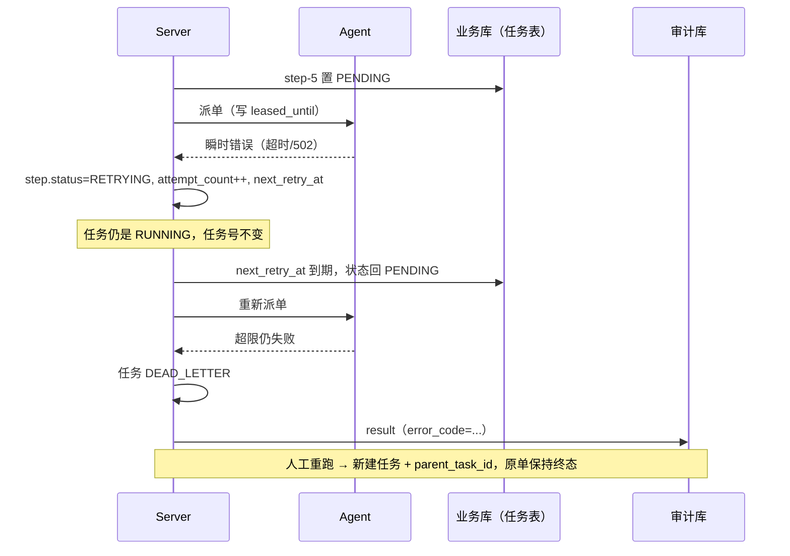
```mermaid
sequenceDiagram
    participant S as Server
    participant A as Agent
    participant PG as 业务库（任务表）
    participant ADB as 审计库

    S->>PG: step-5 置 PENDING
    S->>A: 派单（写 leased_until）
    A-->>S: 瞬时错误（超时/502）
    S->>S: step.status=RETRYING, attempt_count++, next_retry_at
    Note over S: 任务仍是 RUNNING，任务号不变
    S->>PG: next_retry_at 到期，状态回 PENDING
    S->>A: 重新派单
    A-->>S: 超限仍失败
    S->>S: 任务 DEAD_LETTER
    S->>ADB: result（error_code=...）
    Note over S,ADB: 人工重跑 → 新建任务 + parent_task_id，原单保持终态
```

### 4.5 镜像拉取与失败诊断

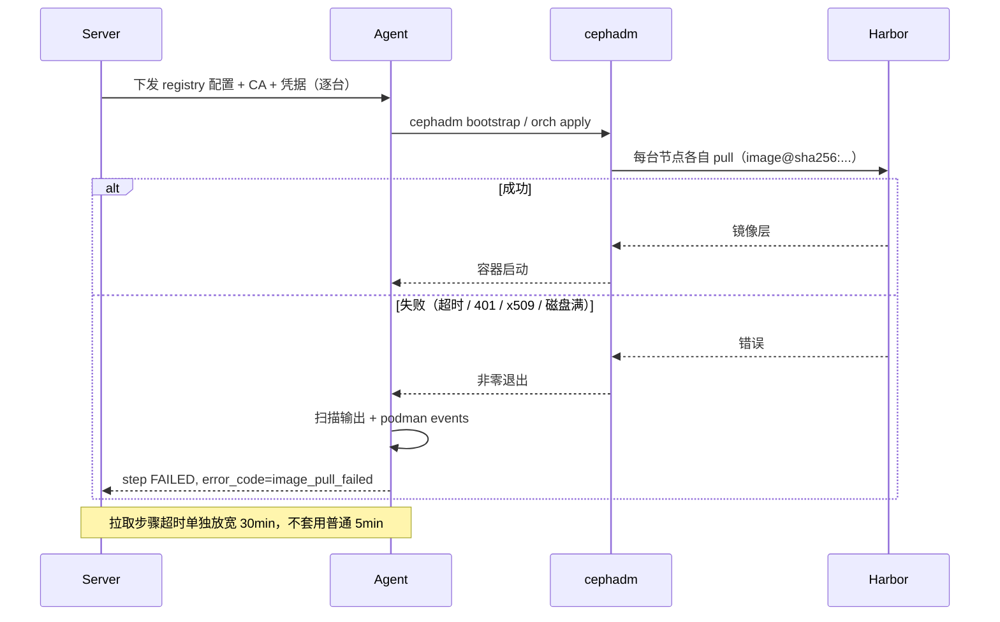
```mermaid
sequenceDiagram
    participant S as Server
    participant A as Agent
    participant CE as cephadm
    participant HR as Harbor

    S->>A: 下发 registry 配置 + CA + 凭据（逐台）
    A->>CE: cephadm bootstrap / orch apply
    CE->>HR: 每台节点各自 pull（image@sha256:...）
    alt 成功
        HR-->>CE: 镜像层
        CE-->>A: 容器启动
    else 失败（超时 / 401 / x509 / 磁盘满）
        HR-->>CE: 错误
        CE-->>A: 非零退出
        A->>A: 扫描输出 + podman events
        A-->>S: step FAILED, error_code=image_pull_failed
    end
    Note over S,A: 拉取步骤超时单独放宽 30min，不套用普通 5min
```

**评审关注**：Harbor 是唯一来源，且**每台节点各自拉**——N 台节点就是 N 份流量、N 个失败点。所以「所有节点可达 Harbor」是硬前置，`image_pull_failed` 必须能定位到具体节点，否则在几十台里查不出是谁拉不到。

### 4.6 状态对账（Reconciler）

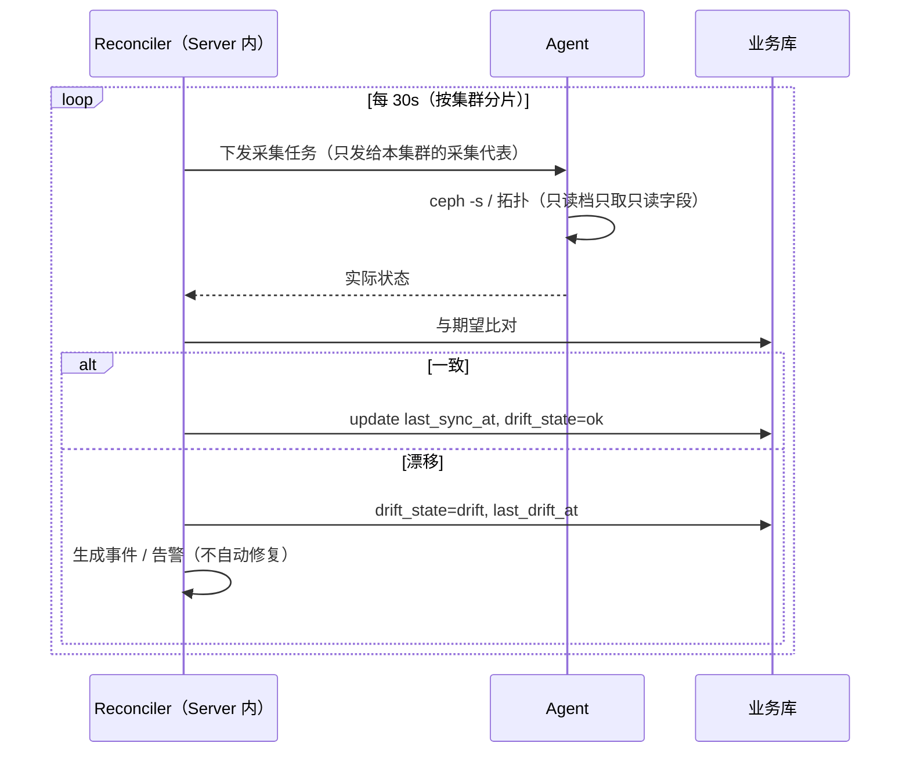
```mermaid
sequenceDiagram
    participant R as Reconciler（Server 内）
    participant A as Agent
    participant PG as 业务库

    loop 每 30s（按集群分片）
        R->>A: 下发采集任务（只发给本集群的采集代表）
        A->>A: ceph -s / 拓扑（只读档只取只读字段）
        A-->>R: 实际状态
        R->>PG: 与期望比对
        alt 一致
            R->>PG: update last_sync_at, drift_state=ok
        else 漂移
            R->>PG: drift_state=drift, last_drift_at
            R->>R: 生成事件 / 告警（不自动修复）
        end
    end
```

### 4.7 指标与告警回流

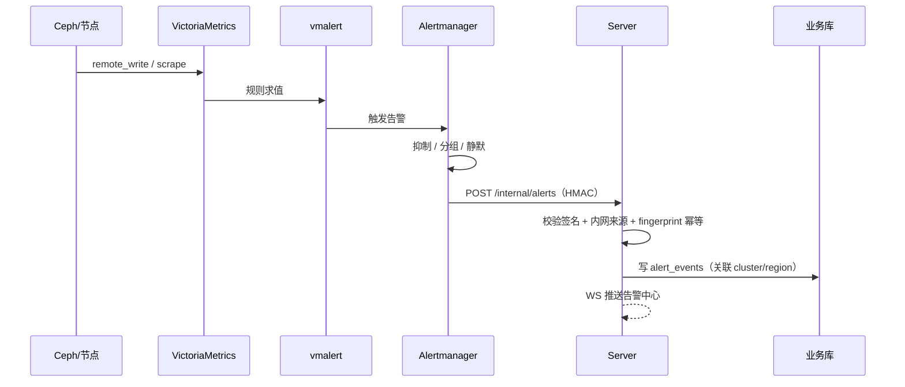
```mermaid
sequenceDiagram
    participant CE as Ceph/节点
    participant VM as VictoriaMetrics
    participant VMA as vmalert
    participant AM as Alertmanager
    participant S as Server
    participant PG as 业务库

    CE->>VM: remote_write / scrape
    VM->>VMA: 规则求值
    VMA->>AM: 触发告警
    AM->>AM: 抑制 / 分组 / 静默
    AM->>S: POST /internal/alerts（HMAC）
    S->>S: 校验签名 + 内网来源 + fingerprint 幂等
    S->>PG: 写 alert_events（关联 cluster/region）
    S-->>S: WS 推送告警中心
```

### 4.8 日志上报与补推

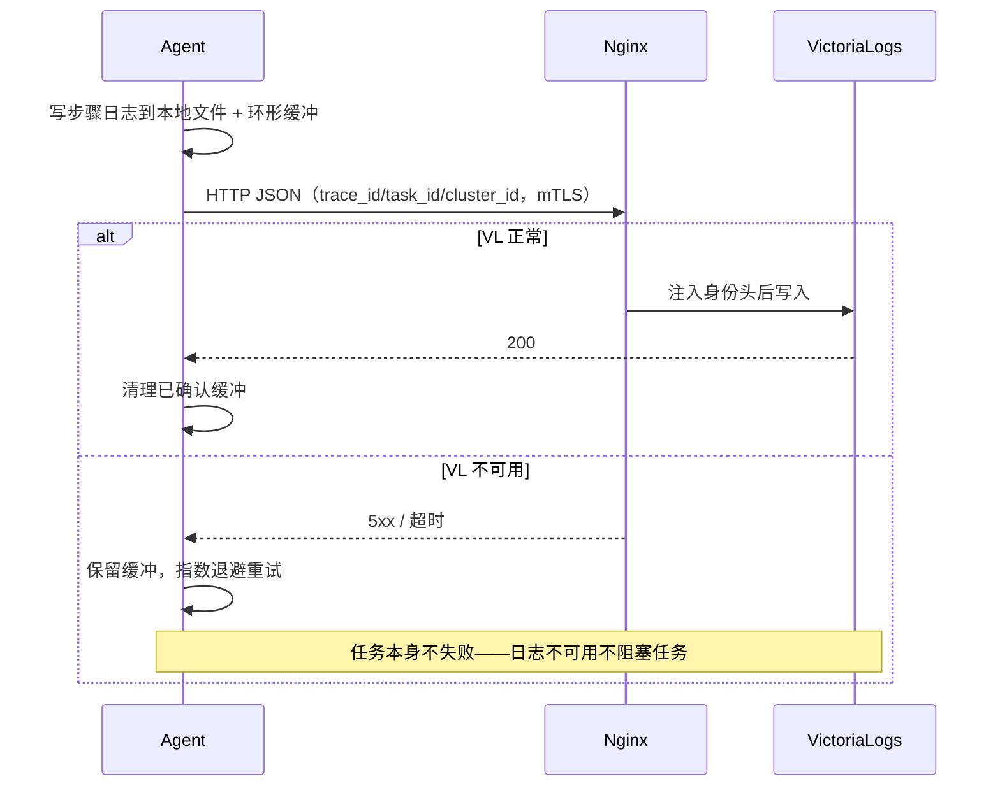
```mermaid
sequenceDiagram
    participant A as Agent
    participant NG as Nginx
    participant VL as VictoriaLogs

    A->>A: 写步骤日志到本地文件 + 环形缓冲
    A->>NG: HTTP JSON（trace_id/task_id/cluster_id，mTLS）
    alt VL 正常
        NG->>VL: 注入身份头后写入
        VL-->>A: 200
        A->>A: 清理已确认缓冲
    else VL 不可用
        NG-->>A: 5xx / 超时
        A->>A: 保留缓冲，指数退避重试
        Note over A,VL: 任务本身不失败——日志不可用不阻塞任务
    end
```

### 4.9 审计两段式写入

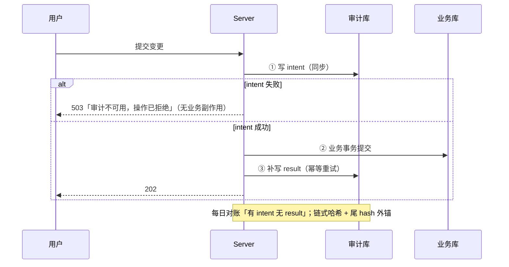
```mermaid
sequenceDiagram
    participant U as 用户
    participant S as Server
    participant ADB as 审计库
    participant PG as 业务库

    U->>S: 提交变更
    S->>ADB: ① 写 intent（同步）
    alt intent 失败
        S-->>U: 503「审计不可用，操作已拒绝」（无业务副作用）
    else intent 成功
        S->>PG: ② 业务事务提交
        S->>ADB: ③ 补写 result（幂等重试）
        S-->>U: 202
    end
    Note over S,ADB: 每日对账「有 intent 无 result」；链式哈希 + 尾 hash 外锚
```


### 4.10 Agent 证书注册 / 轮换 / 吊销

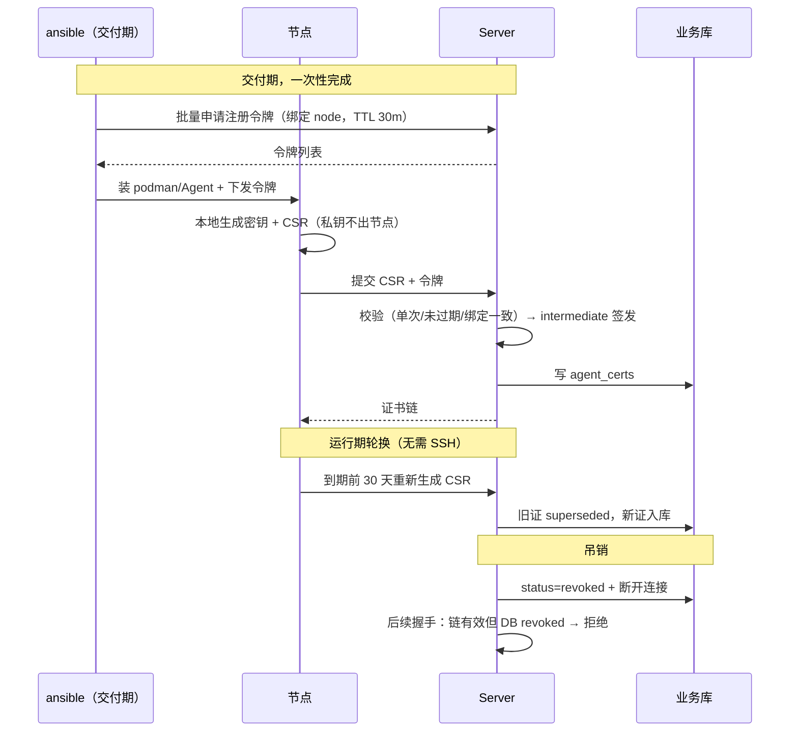
```mermaid
sequenceDiagram
    participant AN as ansible（交付期）
    participant N as 节点
    participant S as Server
    participant PG as 业务库

    Note over AN,S: 交付期，一次性完成
    AN->>S: 批量申请注册令牌（绑定 node，TTL 30m）
    S-->>AN: 令牌列表
    AN->>N: 装 podman/Agent + 下发令牌
    N->>N: 本地生成密钥 + CSR（私钥不出节点）
    N->>S: 提交 CSR + 令牌
    S->>S: 校验（单次/未过期/绑定一致）→ intermediate 签发
    S->>PG: 写 agent_certs
    S-->>N: 证书链

    Note over N,S: 运行期轮换（无需 SSH）
    N->>S: 到期前 30 天重新生成 CSR
    S->>PG: 旧证 superseded，新证入库

    Note over S,PG: 吊销
    S->>PG: status=revoked + 断开连接
    S->>S: 后续握手：链有效但 DB revoked → 拒绝
```

### 4.11 备份与恢复

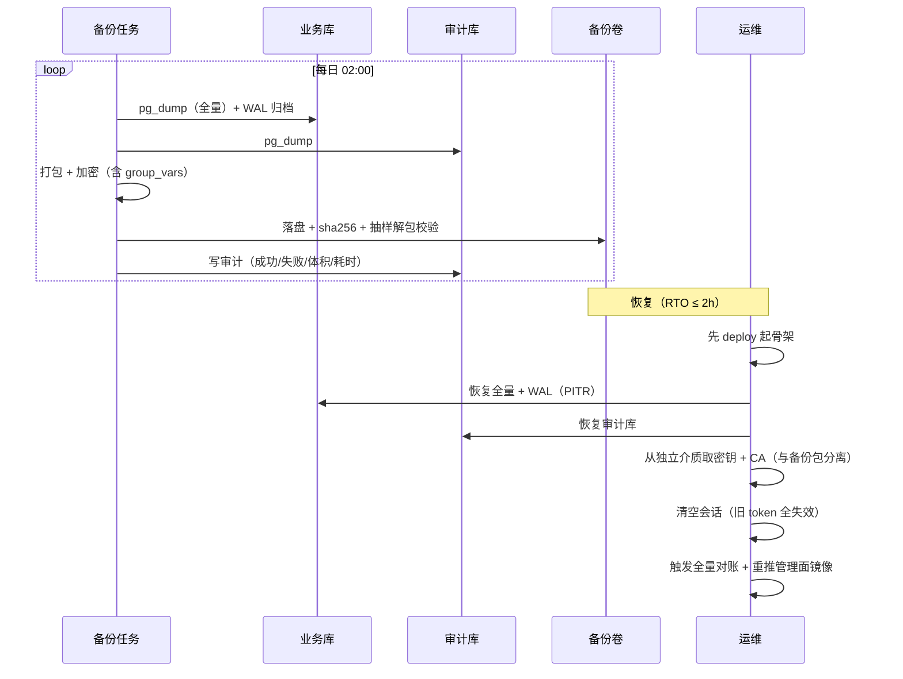
```mermaid
sequenceDiagram
    participant T as 备份任务
    participant PG as 业务库
    participant ADB as 审计库
    participant V as 备份卷
    participant OP as 运维

    loop 每日 02:00
        T->>PG: pg_dump（全量）+ WAL 归档
        T->>ADB: pg_dump
        T->>T: 打包 + 加密（含 group_vars）
        T->>V: 落盘 + sha256 + 抽样解包校验
        T->>ADB: 写审计（成功/失败/体积/耗时）
    end

    Note over OP,V: 恢复（RTO ≤ 2h）
    OP->>OP: 先 deploy 起骨架
    OP->>PG: 恢复全量 + WAL（PITR）
    OP->>ADB: 恢复审计库
    OP->>OP: 从独立介质取密钥 + CA（与备份包分离）
    OP->>OP: 清空会话（旧 token 全失效）
    OP->>OP: 触发全量对账 + 重推管理面镜像
```

### 4.12 保留期清理

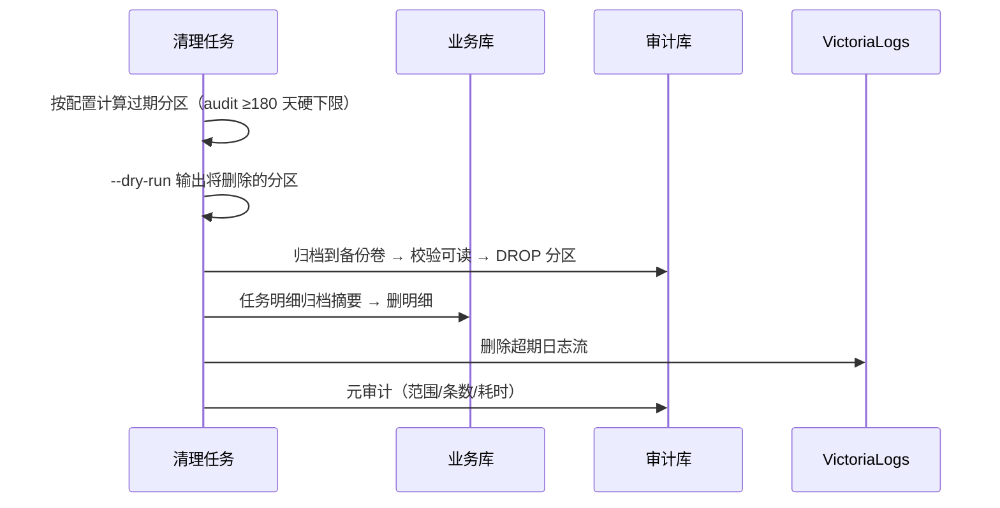
```mermaid
sequenceDiagram
    participant C as 清理任务
    participant PG as 业务库
    participant ADB as 审计库
    participant V as VictoriaLogs

    C->>C: 按配置计算过期分区（audit ≥180 天硬下限）
    C->>C: --dry-run 输出将删除的分区
    C->>ADB: 归档到备份卷 → 校验可读 → DROP 分区
    C->>PG: 任务明细归档摘要 → 删明细
    C->>V: 删除超期日志流
    C->>ADB: 元审计（范围/条数/耗时）
```

### 4.13 告警触发的处置闭环（跨面）

```mermaid
sequenceDiagram
    participant AM as Alertmanager
    participant S as Server
    participant U as 运维
    participant A as Agent

    AM->>S: webhook（cluster 容量告警）
    S->>S: 关联集群 + 去重
    S-->>U: 告警中心 + WS
    U->>S: 选择「扩容 OSD」任务模板
    S->>S: 参数校验 + 审计 intent
    S->>S: 任务落库(PENDING)
    S->>A: 派单（SKIP LOCKED + 租约）
    A->>A: 执行 osd create（argv 白名单）
    A-->>S: 结果 → 告警自动关联处置记录
```

---

## 5. 端到端串演（一次「新建集群」跨 11 个进程）

```mermaid
sequenceDiagram
    autonumber
    participant U as 用户
    participant NG as Nginx
    participant S as Server
    participant ADB as 审计库
    participant PG as 业务库<br/>(任务表即队列)
    participant A as Agent
    participant CE as cephadm/Ceph
    participant VM as VictoriaMetrics
    participant AM as Alertmanager
    participant VL as VictoriaLogs

    U->>NG: 登录 → 提交新建集群
    NG->>S: 转发
    S->>PG: 校验凭据（Argon2id/LDAP）+ 写 refresh
    S->>ADB: intent（建集群）
    S->>PG: clusters + tasks + DAG + 绑定 cluster_id
    S->>PG: step-1 落库(PENDING)
    S->>A: 派单
    A->>A: 本地 precheck（只读）
    A-->>S: 结果
    S->>A: 派发 step-2
    A->>A: 装 podman / 下发 registry CA 与凭据
    S->>A: 派发 step-3
    A->>CE: cephadm bootstrap（pull 镜像）
    CE-->>A: FSID
    A-->>S: FSID + 状态
    A->>NG: 日志（mTLS）
    NG->>VL: 写入
    S->>ADB: result
    CE->>VM: 指标
    VM->>AM: 规则触发（如 CPU 高位）
    AM->>S: webhook
    S->>PG: alert_events
    S-->>U: WS 进度 + 告警 + HEALTH_OK
```

| 阶段 | 跨了哪些进程 | 关键不变式 |
| --- | --- | --- |
| 认证 | U→NG→S→PG | 角色在 JWT，改角色靠 ver 失效 |
| 预检/初始化 | S→PG→A（节点本地） | 全程无 SSH；agent 在交付期已预装 |
| bootstrap | S→A→CE→Harbor | Server 不碰 Ceph；镜像 digest 固定 |
| 观测 | A→NG→VL；CE→VM→AM→S | 日志不进 Server；告警幂等 |
| 收尾 | S→ADB | result 可缺，靠对账补 |

---

## 6. 失败点索引（对应 §4 各图）

| 失败点 | 表现 | 兜底 | 图 |
| --- | --- | --- | --- |
| LDAP 不可用 | LDAP 用户登不进 | 本地管理员 break-glass | 4.1 |
| 审计库不可用 | 写操作 503 | 读不受影响；刻意选择 | 4.9 |
| 预检失败 | step-1 FAILED | 给出期望/实际/修法，修完重跑 | 4.2 |
| 初始化中断 | Agent 升级/配置中途 | 人工到节点处理（运行期无 SSH，须走交付期工具） | 4.2 / 4.10 |
| 镜像拉取失败 | `image_pull_failed`（须定位到节点） | 整步重试（30min 超时）；先查该节点到 Harbor 的连通与 CA | 4.5 |
| 步骤瞬时失败 | RETRYING | 退避重试 5 次 | 4.4 |
| 重试超限 | DEAD_LETTER | 死信入口 + 告警 | 4.4 |
| Ceph 漂移 | drift_state=drift | 告警，不自动修 | 4.6 |
| VL 不可用 | 日志缺失 | 本地缓冲 + UI 提示 | 4.8 |
| 证书被吊销 | 握手被拒 | 重新走注册（需交付期工具介入） | 4.10 |
| 备份失败 | 无备份包 | 连续失败升级告警 | 4.11 |
| 磁盘 90% | 拒绝新写任务 | 只读保护，读不受影响 | 4.12 |

---

## 7. 评审检查清单

看完图后逐条打勾，任何一条"打不上"就是设计问题：

- [ ] 每张图里的进程，都在 §2 清单里且协议一致；
- [ ] 没有任何一条数据流**绕过审计**（写操作必须过 4.9）；
- [ ] 没有任何运行期链路依赖 **SSH**（运行期应为零 SSH，只在交付期用 ansible）;
- [ ] 没有任何链路让 **Server 直连 Ceph**（mgr REST / cephadm / ceph CLI 都不允许）；
- [ ] 没有任何进程**同时写**同一份存储（见全景 §3 数据所有权）；
- [ ] 每条异步链路都能回答"消息丢了怎么办"；
- [ ] 每条同步链路都能回答"对端挂了会怎样"；
- [ ] 图里出现的每个字段（`trace_id`/`log_ref`/`drift_state`）在数据模型里都有；
- [ ] 端到端串演（§5）中每一步都能在 §4 找到对应的详细图；
- [ ] 大规模（§1.1）下每条 Agent 连接都有明确 shard 归属，且**备用 endpoint 不指向同片**；
- [ ] 任务派发路径上没有**跨副本转发**（一旦出现，说明分片失效）。
