# 架构时序与数据流图册（Review 稿）

| 项目 | 内容 |
| --- | --- |
| 状态 | **待评审** |
| 日期 | 2026-11-15 |
| 用途 | 用图 review 整体架构：进程怎么连、数据怎么流、每一步失败会怎样 |
| 关系 | [系统架构与数据流全景](系统架构与数据流全景.md) 是**表格速览**，本册是**图形细节**；两者冲突时以 ADR 为准 |

---

## 0. 怎么用

- 只想知道"有哪些进程"→ §1、§2；
- 想验证"数据从哪来到哪去"→ §3（4 张数据流图）；
- 想验证"某条链路怎么走、失败怎么办"→ §4（13 张时序图）；
- 想验证"整个系统串起来是否自洽"→ §5（端到端串演，一张图跨 11 个进程）。

图例：实线箭头 = 同步调用；虚线箭头 = 异步/推送；`Note` = 关键切换点。

---

## 1. 全局进程交互图

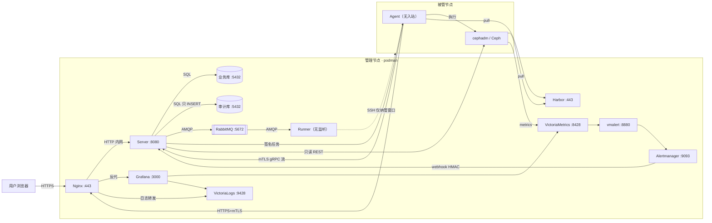
```mermaid
graph LR
  U["用户浏览器"]

  subgraph M["管理节点 · podman"]
    NG["Nginx :443"]
    S["Server :8080"]
    RN["Runner（无监听）"]
    PG[("业务库 :5432")]
    ADB[("审计库 :5432")]
    MQ[["RabbitMQ :5672"]]
    HR["Harbor :443"]
    VM["VictoriaMetrics :8428"]
    VL["VictoriaLogs :9428"]
    VMA["vmalert :8880"]
    AM["Alertmanager :9093"]
    GF["Grafana :3000"]
  end

  subgraph N["被管节点"]
    A["Agent（无入站）"]
    CE["cephadm / Ceph"]
  end

  U -->|HTTPS| NG
  NG -->|HTTP 内网| S
  NG -->|反代| GF
  NG -->|日志转发| VL
  S -->|SQL| PG
  S -->|SQL 只 INSERT| ADB
  S -->|AMQP| MQ
  MQ -->|AMQP| RN
  RN -.->|SSH 仅纳管窗口| N
  A -->|mTLS gRPC 流| S
  S -->|签名任务| A
  A -->|HTTPS+mTLS| NG
  A -->|执行| CE
  A -->|pull| HR
  CE -->|pull| HR
  CE -->|metrics| VM
  VM --> VMA
  VMA --> AM
  AM -->|webhook HMAC| S
  S -->|只读 REST| CE
  GF --> VM
  GF --> VL
```

**三个非对称点**（评审重点）：

| 非对称 | 原因 |
| --- | --- |
| Agent **无入站端口**，只有出站 | 拉模式；节点上不开监听，扫描扫不到 |
| Grafana 只能经 Nginx | 直连会绕过 RBAC，viewer 能看任意集群 |
| Runner 走 SSH，Agent 走 mTLS | 纳管窗口 vs 运行期，两者互斥（ADR-23） |

---

## 2. 进程交互矩阵

发起方（行）→ 接收方（列）：

| 从 ＼ 到 | Nginx | Server | Runner | PG | 审计库 | MQ | Agent | Ceph | VM | VL | AM | Harbor |
| --- | --- | --- | --- | --- | --- | --- | --- | --- | --- | --- | --- | --- |
| 浏览器 | HTTPS | — | — | — | — | — | — | — | — | — | — | — |
| Nginx | — | HTTP | — | — | — | — | — | — | — | 日志 | — | — |
| Server | — | — | — | SQL | SQL | AMQP | 签名任务 | mgr REST | 查询 | — | — | — |
| Runner | — | — | — | 读任务 | — | — | — | 经 SSH | — | — | — | — |
| Agent | 日志 | mTLS | — | — | — | — | — | 执行 | — | — | — | pull |
| cephadm | — | — | — | — | — | — | — | — | metrics | — | — | pull |
| vmalert | — | — | — | — | — | — | — | — | 查询 | — | 告警 | — |
| Alertmanager | — | webhook | — | — | — | — | — | — | — | — | — | — |
| Grafana | — | — | — | — | — | — | — | — | 查询 | 查询 | — | — |

### 2.1 每个进程的进出清单

| 进程 | 入站（谁 → 它：什么） | 出站（它 → 谁：什么） | 触发时机 |
| --- | --- | --- | --- |
| Nginx | 浏览器：页面/API；Agent：日志 | Server：转发；Grafana：反代；VL：写入 | 持续 |
| Server | Nginx：API；Agent：心跳/回报；AM：告警 | PG/审计库/MQ/VM/mgr API | 持续 |
| Runner | MQ：`executor=runner` 任务 | 节点：SSH（预检/初始化） | **仅纳管窗口** |
| Agent | Server：签名任务 | Server：心跳/结果；Nginx：日志；Harbor：pull；节点：执行 | 持续（30s 心跳） |
| 业务库 | Server | — | 持续 |
| 审计库 | Server（只 INSERT） | — | 每次写操作 |
| RabbitMQ | Server | Agent（经 Server）、Runner | 任务提交时 |
| Harbor | 制包机、节点、cephadm | — | 部署/升级 |
| VictoriaMetrics | 采集端 | vmalert、Grafana、Server | 持续 |
| VictoriaLogs | Nginx | Grafana、Server | 持续 |
| vmalert | VM | Alertmanager | 规则求值周期 |
| Alertmanager | vmalert | Server | 告警触发 |
| Grafana | Nginx | VM、VL | 用户打开面板 |

---

## 3. 数据流图（DFD）

### 3.1 控制面：请求 → 任务 → 执行

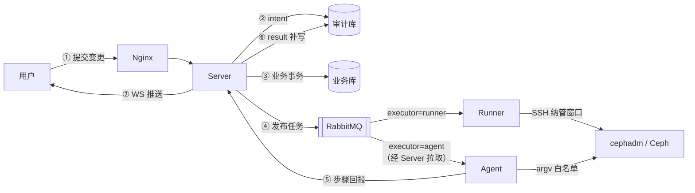
```mermaid
flowchart LR
  U["用户"] -->|"① 提交变更"| NG["Nginx"]
  NG --> S["Server"]
  S -->|"② intent"| ADB[("审计库")]
  S -->|"③ 业务事务"| PG[("业务库")]
  S -->|"④ 发布任务"| MQ[["RabbitMQ"]]
  MQ -->|"executor=runner"| RN["Runner"]
  MQ -->|"executor=agent<br/>（经 Server 拉取）"| A["Agent"]
  RN -->|"SSH 纳管窗口"| CE["cephadm / Ceph"]
  A -->|"argv 白名单"| CE
  A -->|"⑤ 步骤回报"| S
  S -->|"⑥ result 补写"| ADB
  S -->|"⑦ WS 推送"| U
```

### 3.2 观测面：指标、日志、告警

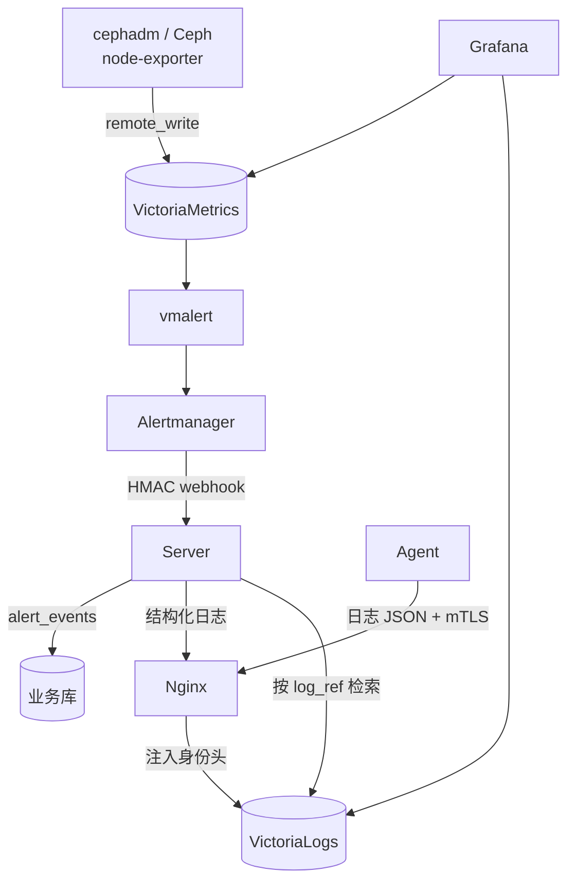
```mermaid
flowchart TB
  CE["cephadm / Ceph<br/>node-exporter"] -->|remote_write| VM[("VictoriaMetrics")]
  VM --> VMA["vmalert"]
  VMA --> AM["Alertmanager"]
  AM -->|"HMAC webhook"| S["Server"]
  S -->|"alert_events"| PG[("业务库")]
  A["Agent"] -->|"日志 JSON + mTLS"| NG["Nginx"]
  S -->|"结构化日志"| NG
  NG -->|"注入身份头"| VL[("VictoriaLogs")]
  GF["Grafana"] --> VM
  GF --> VL
  S -->|"按 log_ref 检索"| VL
```

**边界**：日志**不进 Server**（不代理字节）；指标**不进 PG**；告警进 PG 但不进审计库。

### 3.3 凭据与密钥流（此前缺图的一条）

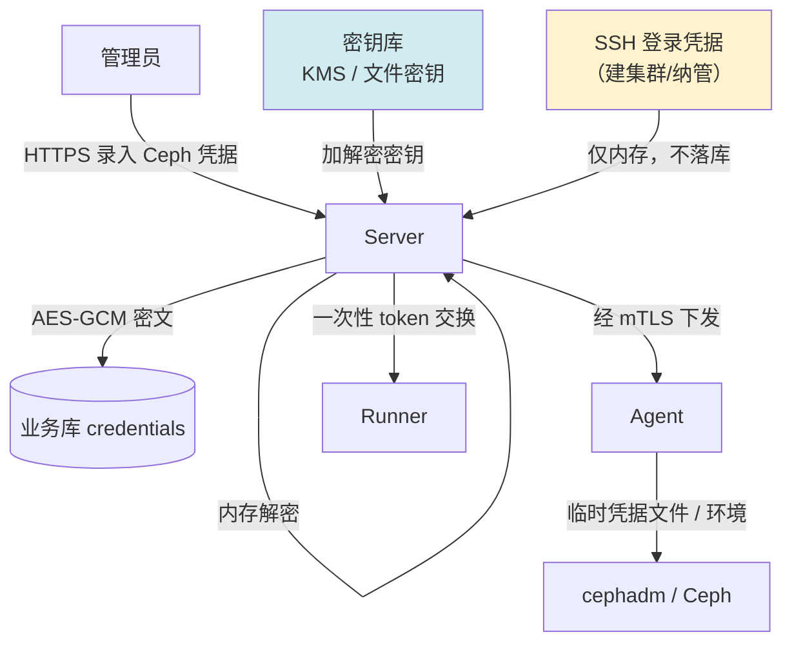
```mermaid
flowchart TB
  U["管理员"] -->|"HTTPS 录入 Ceph 凭据"| S["Server"]
  KMS["密钥库<br/>KMS / 文件密钥"] -->|"加解密密钥"| S
  S -->|"AES-GCM 密文"| PG[("业务库 credentials")]
  S -->|"内存解密"| S
  S -->|"经 mTLS 下发"| A["Agent"]
  A -->|"临时凭据文件 / 环境"| CE["cephadm / Ceph"]

  SSH["SSH 登录凭据<br/>（建集群/纳管）"] -->|"仅内存，不落库"| S
  S -->|"一次性 token 交换"| RN["Runner"]

  style SSH fill:#fff3cd
  style KMS fill:#d1ecf1
```

**要点**：Ceph 凭据「密文入库、内存解密、只在 mTLS 通道里传」；SSH 凭据**不入库**，绑任务会话，终态擦除（ADR-24）；密钥本身与备份包物理分离（ADR-31）。

### 3.4 审计流（两段式 + 链式哈希）

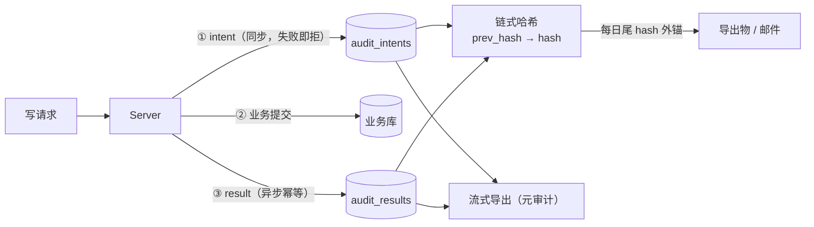
```mermaid
flowchart LR
  RQ["写请求"] --> S["Server"]
  S -->|"① intent（同步，失败即拒）"| A1[("audit_intents")]
  S -->|"② 业务提交"| PG[("业务库")]
  S -->|"③ result（异步幂等）"| A2[("audit_results")]
  A1 --> CH["链式哈希<br/>prev_hash → hash"]
  A2 --> CH
  CH -->|"每日尾 hash 外锚"| EXT["导出物 / 邮件"]
  A1 --> EXP["流式导出（元审计）"]
  A2 --> EXP
```

---

## 4. 时序图（13 条）

### 4.1 登录与会话（local / LDAP 双分支）

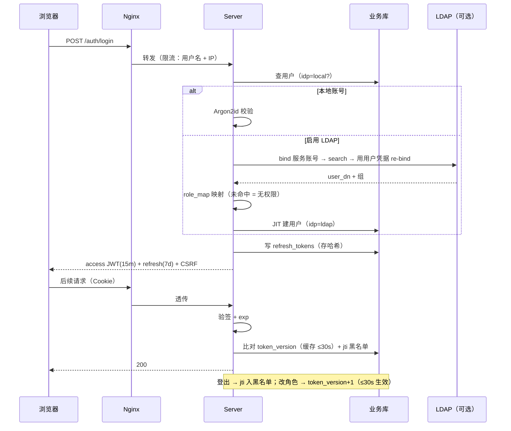
```mermaid
sequenceDiagram
    participant U as 浏览器
    participant NG as Nginx
    participant S as Server
    participant PG as 业务库
    participant L as LDAP（可选）

    U->>NG: POST /auth/login
    NG->>S: 转发（限流：用户名 + IP）
    S->>PG: 查用户（idp=local?）
    alt 本地账号
        S->>S: Argon2id 校验
    else 启用 LDAP
        S->>L: bind 服务账号 → search → 用用户凭据 re-bind
        L-->>S: user_dn + 组
        S->>S: role_map 映射（未命中 = 无权限）
        S->>PG: JIT 建用户（idp=ldap）
    end
    S->>PG: 写 refresh_tokens（存哈希）
    S-->>U: access JWT(15m) + refresh(7d) + CSRF
    U->>NG: 后续请求（Cookie）
    NG->>S: 透传
    S->>S: 验签 + exp
    S->>PG: 比对 token_version（缓存 ≤30s）+ jti 黑名单
    S-->>U: 200
    Note over S,PG: 登出 → jti 入黑名单；改角色 → token_version+1（≤30s 生效）
```

**失败分支**：LDAP 不可用 → 本地管理员仍可登录（break-glass）；密码错与用户不存在返回同一提示（防枚举）。

### 4.2 新建集群（Runner → Agent 切换）

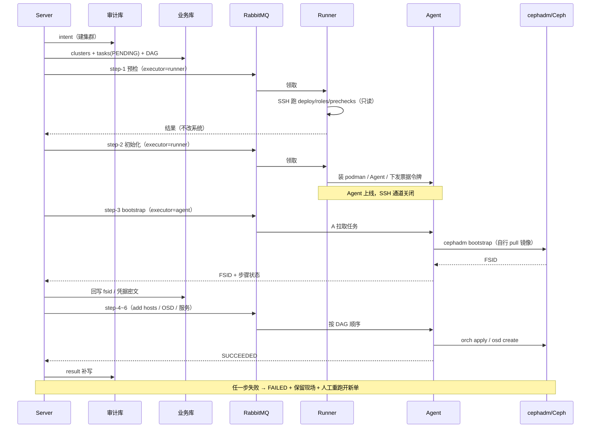
```mermaid
sequenceDiagram
    participant S as Server
    participant ADB as 审计库
    participant PG as 业务库
    participant MQ as RabbitMQ
    participant RN as Runner
    participant A as Agent
    participant CE as cephadm/Ceph

    S->>ADB: intent（建集群）
    S->>PG: clusters + tasks(PENDING) + DAG
    S->>MQ: step-1 预检（executor=runner）
    MQ->>RN: 领取
    RN->>RN: SSH 跑 deploy/roles/prechecks（只读）
    RN-->>S: 结果（不改系统）
    S->>MQ: step-2 初始化（executor=runner）
    MQ->>RN: 领取
    RN->>A: 装 podman / Agent / 下发票据令牌
    Note over RN,A: Agent 上线，SSH 通道关闭
    S->>MQ: step-3 bootstrap（executor=agent）
    MQ->>A: A 拉取任务
    A->>CE: cephadm bootstrap（自行 pull 镜像）
    CE-->>A: FSID
    A-->>S: FSID + 步骤状态
    S->>PG: 回写 fsid / 凭据密文
    S->>MQ: step-4~6（add hosts / OSD / 服务）
    MQ->>A: 按 DAG 顺序
    A->>CE: orch apply / osd create
    A-->>S: SUCCEEDED
    S->>ADB: result 补写
    Note over S,CE: 任一步失败 → FAILED + 保留现场 + 人工重跑开新单
```

**评审关注**：step-1/2 一定不能由 Agent 做（那时它还不存在）；step-3 之后**不允许**再出现 SSH。

### 4.3 纳管已有集群（双通道）

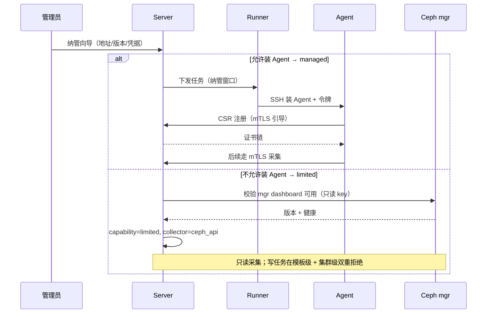
```mermaid
sequenceDiagram
    participant U as 管理员
    participant S as Server
    participant RN as Runner
    participant A as Agent
    participant M as Ceph mgr

    U->>S: 纳管向导（地址/版本/凭据）
    alt 允许装 Agent → managed
        S->>RN: 下发任务（纳管窗口）
        RN->>A: SSH 装 Agent + 令牌
        A->>S: CSR 注册（mTLS 引导）
        S-->>A: 证书链
        A->>S: 后续走 mTLS 采集
    else 不允许装 Agent → limited
        S->>M: 校验 mgr dashboard 可用（只读 key）
        M-->>S: 版本 + 健康
        S->>S: capability=limited, collector=ceph_api
        Note over S,M: 只读采集；写任务在模板级 + 集群级双重拒绝
    end
```

**评审关注**：limited 拿不到 mgr API 时**必须明确失败**，不允许退回 SSH。

### 4.4 任务重试与人工重跑

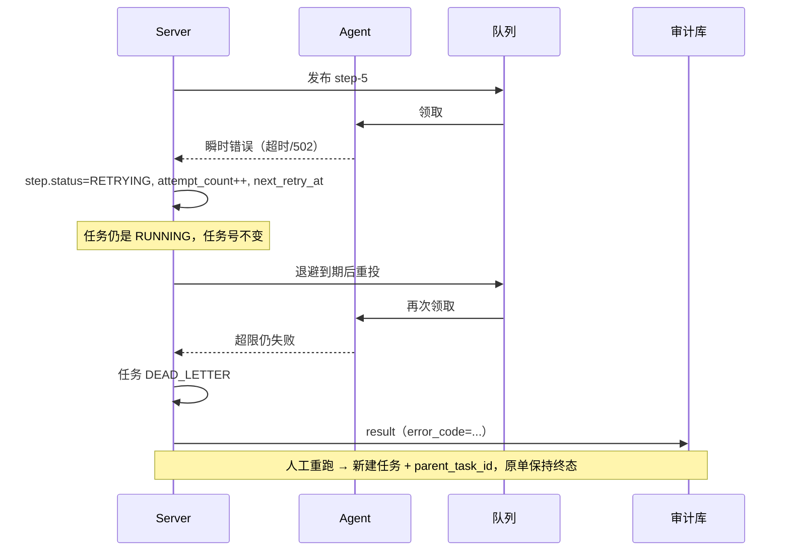
```mermaid
sequenceDiagram
    participant S as Server
    participant A as Agent
    participant Q as 队列
    participant ADB as 审计库

    S->>Q: 发布 step-5
    Q->>A: 领取
    A-->>S: 瞬时错误（超时/502）
    S->>S: step.status=RETRYING, attempt_count++, next_retry_at
    Note over S: 任务仍是 RUNNING，任务号不变
    S->>Q: 退避到期后重投
    Q->>A: 再次领取
    A-->>S: 超限仍失败
    S->>S: 任务 DEAD_LETTER
    S->>ADB: result（error_code=...）
    Note over S,ADB: 人工重跑 → 新建任务 + parent_task_id，原单保持终态
```

### 4.5 镜像拉取与失败诊断

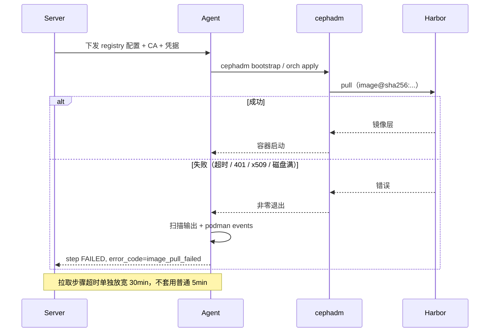
```mermaid
sequenceDiagram
    participant S as Server
    participant A as Agent
    participant CE as cephadm
    participant HR as Harbor

    S->>A: 下发 registry 配置 + CA + 凭据
    A->>CE: cephadm bootstrap / orch apply
    CE->>HR: pull（image@sha256:...）
    alt 成功
        HR-->>CE: 镜像层
        CE-->>A: 容器启动
    else 失败（超时 / 401 / x509 / 磁盘满）
        HR-->>CE: 错误
        CE-->>A: 非零退出
        A->>A: 扫描输出 + podman events
        A-->>S: step FAILED, error_code=image_pull_failed
    end
    Note over S,A: 拉取步骤超时单独放宽 30min，不套用普通 5min
```

### 4.6 状态对账（Reconciler）

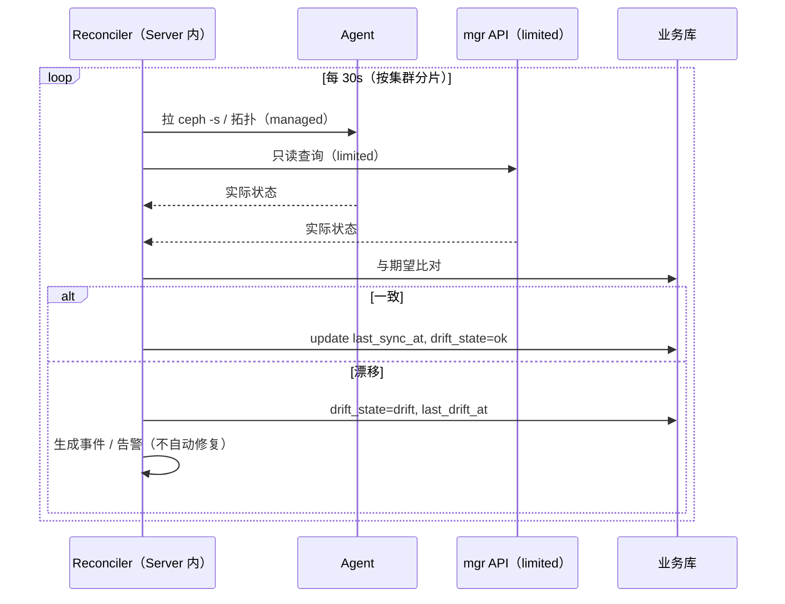
```mermaid
sequenceDiagram
    participant R as Reconciler（Server 内）
    participant A as Agent
    participant M as mgr API（limited）
    participant PG as 业务库

    loop 每 30s（按集群分片）
        R->>A: 拉 ceph -s / 拓扑（managed）
        R->>M: 只读查询（limited）
        A-->>R: 实际状态
        M-->>R: 实际状态
        R->>PG: 与期望比对
        alt 一致
            R->>PG: update last_sync_at, drift_state=ok
        else 漂移
            R->>PG: drift_state=drift, last_drift_at
            R->>R: 生成事件 / 告警（不自动修复）
        end
    end
```

### 4.7 指标与告警回流

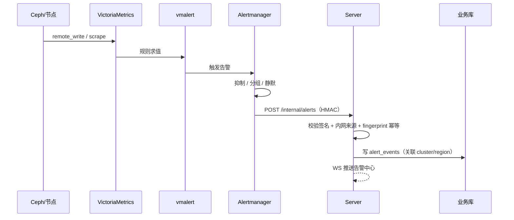
```mermaid
sequenceDiagram
    participant CE as Ceph/节点
    participant VM as VictoriaMetrics
    participant VMA as vmalert
    participant AM as Alertmanager
    participant S as Server
    participant PG as 业务库

    CE->>VM: remote_write / scrape
    VM->>VMA: 规则求值
    VMA->>AM: 触发告警
    AM->>AM: 抑制 / 分组 / 静默
    AM->>S: POST /internal/alerts（HMAC）
    S->>S: 校验签名 + 内网来源 + fingerprint 幂等
    S->>PG: 写 alert_events（关联 cluster/region）
    S-->>S: WS 推送告警中心
```

### 4.8 日志上报与补推

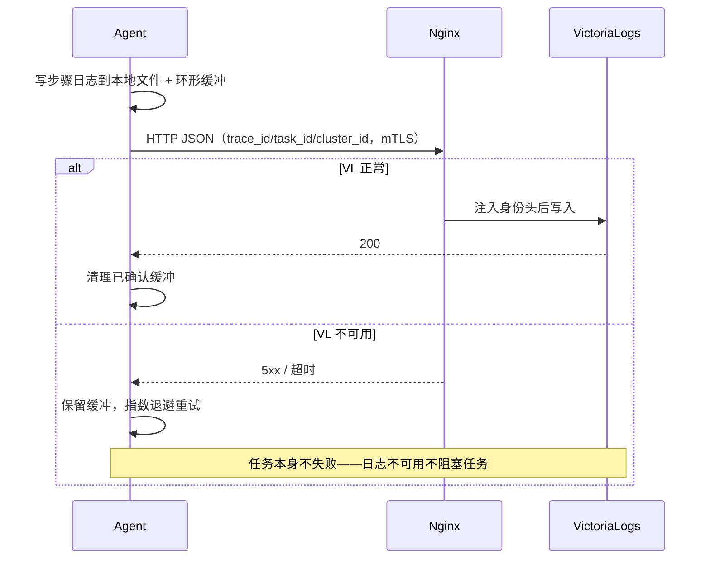
```mermaid
sequenceDiagram
    participant A as Agent
    participant NG as Nginx
    participant VL as VictoriaLogs

    A->>A: 写步骤日志到本地文件 + 环形缓冲
    A->>NG: HTTP JSON（trace_id/task_id/cluster_id，mTLS）
    alt VL 正常
        NG->>VL: 注入身份头后写入
        VL-->>A: 200
        A->>A: 清理已确认缓冲
    else VL 不可用
        NG-->>A: 5xx / 超时
        A->>A: 保留缓冲，指数退避重试
        Note over A,VL: 任务本身不失败——日志不可用不阻塞任务
    end
```

### 4.9 审计两段式写入

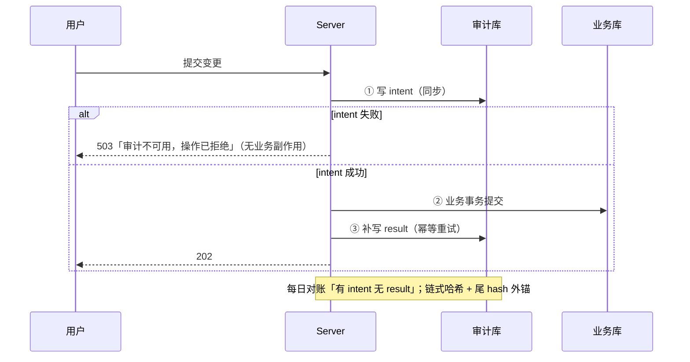
```mermaid
sequenceDiagram
    participant U as 用户
    participant S as Server
    participant ADB as 审计库
    participant PG as 业务库

    U->>S: 提交变更
    S->>ADB: ① 写 intent（同步）
    alt intent 失败
        S-->>U: 503「审计不可用，操作已拒绝」（无业务副作用）
    else intent 成功
        S->>PG: ② 业务事务提交
        S->>ADB: ③ 补写 result（幂等重试）
        S-->>U: 202
    end
    Note over S,ADB: 每日对账「有 intent 无 result」；链式哈希 + 尾 hash 外锚
```

### 4.10 Agent 证书注册 / 轮换 / 吊销

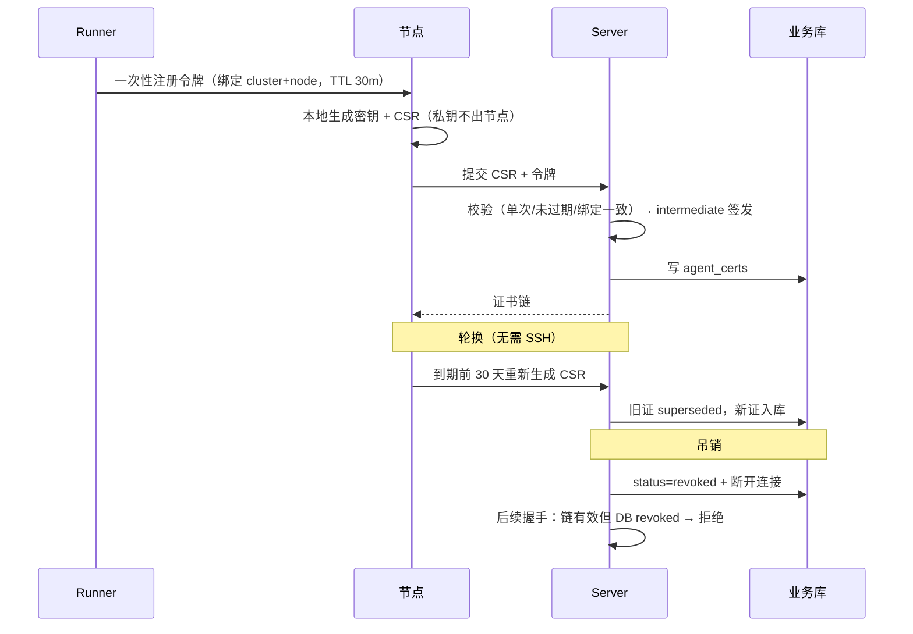
```mermaid
sequenceDiagram
    participant RN as Runner
    participant N as 节点
    participant S as Server
    participant PG as 业务库

    RN->>N: 一次性注册令牌（绑定 cluster+node，TTL 30m）
    N->>N: 本地生成密钥 + CSR（私钥不出节点）
    N->>S: 提交 CSR + 令牌
    S->>S: 校验（单次/未过期/绑定一致）→ intermediate 签发
    S->>PG: 写 agent_certs
    S-->>N: 证书链

    Note over N,S: 轮换（无需 SSH）
    N->>S: 到期前 30 天重新生成 CSR
    S->>PG: 旧证 superseded，新证入库

    Note over S,PG: 吊销
    S->>PG: status=revoked + 断开连接
    S->>S: 后续握手：链有效但 DB revoked → 拒绝
```

### 4.11 备份与恢复

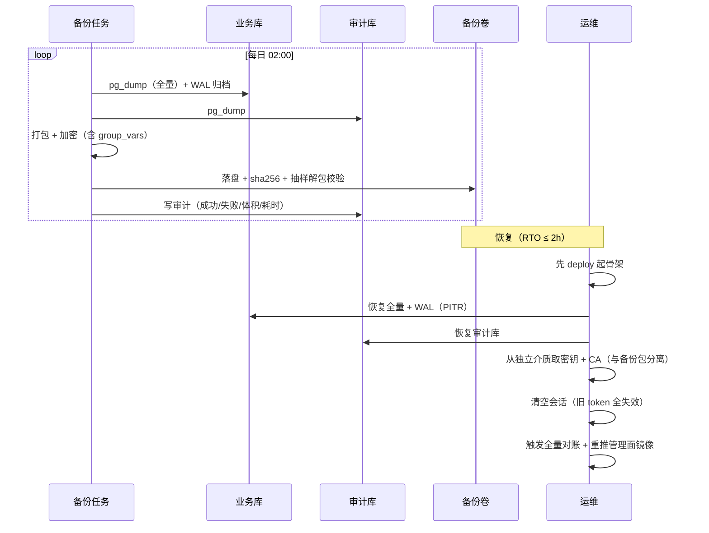
```mermaid
sequenceDiagram
    participant T as 备份任务
    participant PG as 业务库
    participant ADB as 审计库
    participant V as 备份卷
    participant OP as 运维

    loop 每日 02:00
        T->>PG: pg_dump（全量）+ WAL 归档
        T->>ADB: pg_dump
        T->>T: 打包 + 加密（含 group_vars）
        T->>V: 落盘 + sha256 + 抽样解包校验
        T->>ADB: 写审计（成功/失败/体积/耗时）
    end

    Note over OP,V: 恢复（RTO ≤ 2h）
    OP->>OP: 先 deploy 起骨架
    OP->>PG: 恢复全量 + WAL（PITR）
    OP->>ADB: 恢复审计库
    OP->>OP: 从独立介质取密钥 + CA（与备份包分离）
    OP->>OP: 清空会话（旧 token 全失效）
    OP->>OP: 触发全量对账 + 重推管理面镜像
```

### 4.12 保留期清理

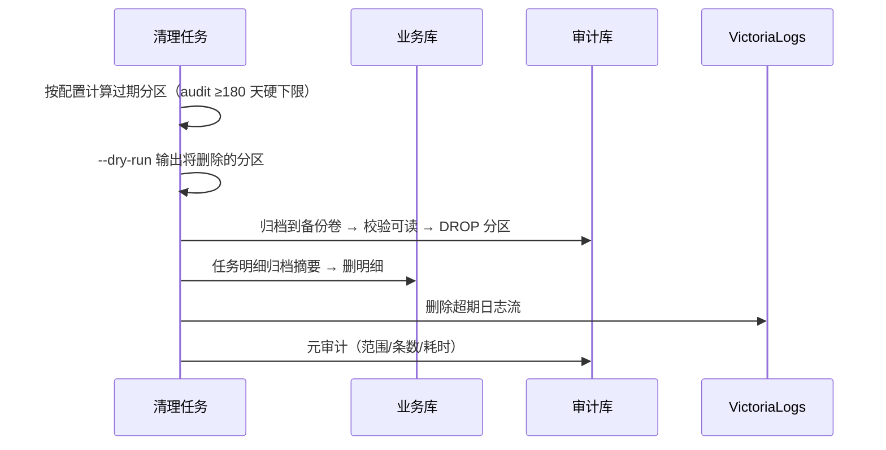
```mermaid
sequenceDiagram
    participant C as 清理任务
    participant PG as 业务库
    participant ADB as 审计库
    participant V as VictoriaLogs

    C->>C: 按配置计算过期分区（audit ≥180 天硬下限）
    C->>C: --dry-run 输出将删除的分区
    C->>ADB: 归档到备份卷 → 校验可读 → DROP 分区
    C->>PG: 任务明细归档摘要 → 删明细
    C->>V: 删除超期日志流
    C->>ADB: 元审计（范围/条数/耗时）
```

### 4.13 告警触发的处置闭环（跨面）

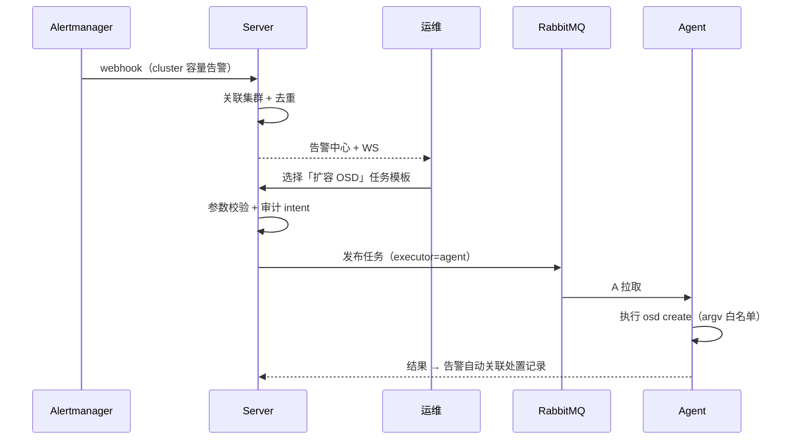
```mermaid
sequenceDiagram
    participant AM as Alertmanager
    participant S as Server
    participant U as 运维
    participant MQ as RabbitMQ
    participant A as Agent

    AM->>S: webhook（cluster 容量告警）
    S->>S: 关联集群 + 去重
    S-->>U: 告警中心 + WS
    U->>S: 选择「扩容 OSD」任务模板
    S->>S: 参数校验 + 审计 intent
    S->>MQ: 发布任务（executor=agent）
    MQ->>A: A 拉取
    A->>A: 执行 osd create（argv 白名单）
    A-->>S: 结果 → 告警自动关联处置记录
```

---

## 5. 端到端串演（一次「新建集群」跨 11 个进程）

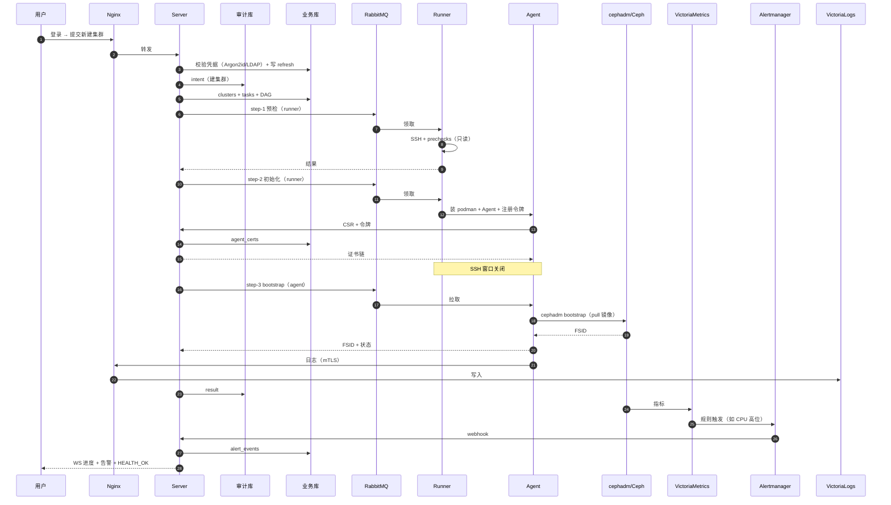
```mermaid
sequenceDiagram
    autonumber
    participant U as 用户
    participant NG as Nginx
    participant S as Server
    participant ADB as 审计库
    participant PG as 业务库
    participant MQ as RabbitMQ
    participant RN as Runner
    participant A as Agent
    participant CE as cephadm/Ceph
    participant VM as VictoriaMetrics
    participant AM as Alertmanager
    participant VL as VictoriaLogs

    U->>NG: 登录 → 提交新建集群
    NG->>S: 转发
    S->>PG: 校验凭据（Argon2id/LDAP）+ 写 refresh
    S->>ADB: intent（建集群）
    S->>PG: clusters + tasks + DAG
    S->>MQ: step-1 预检（runner）
    MQ->>RN: 领取
    RN->>RN: SSH + prechecks（只读）
    RN-->>S: 结果
    S->>MQ: step-2 初始化（runner）
    MQ->>RN: 领取
    RN->>A: 装 podman + Agent + 注册令牌
    A->>S: CSR + 令牌
    S->>PG: agent_certs
    S-->>A: 证书链
    Note over RN,A: SSH 窗口关闭
    S->>MQ: step-3 bootstrap（agent）
    MQ->>A: 拉取
    A->>CE: cephadm bootstrap（pull 镜像）
    CE-->>A: FSID
    A-->>S: FSID + 状态
    A->>NG: 日志（mTLS）
    NG->>VL: 写入
    S->>ADB: result
    CE->>VM: 指标
    VM->>AM: 规则触发（如 CPU 高位）
    AM->>S: webhook
    S->>PG: alert_events
    S-->>U: WS 进度 + 告警 + HEALTH_OK
```

| 阶段 | 跨了哪些进程 | 关键不变式 |
| --- | --- | --- |
| 认证 | U→NG→S→PG | 角色在 JWT，改角色靠 ver 失效 |
| 预检/初始化 | S→MQ→RN→节点 | 仅此时用 SSH；凭据只在内存 |
| bootstrap | S→MQ→A→CE→Harbor | 无 SSH；镜像 digest 固定 |
| 观测 | A→NG→VL；CE→VM→AM→S | 日志不进 Server；告警幂等 |
| 收尾 | S→ADB | result 可缺，靠对账补 |

---

## 6. 失败点索引（对应 §4 各图）

| 失败点 | 表现 | 兜底 | 图 |
| --- | --- | --- | --- |
| LDAP 不可用 | LDAP 用户登不进 | 本地管理员 break-glass | 4.1 |
| 审计库不可用 | 写操作 503 | 读不受影响；刻意选择 | 4.9 |
| 预检失败 | step-1 FAILED | 给出期望/实际/修法，修完重跑 | 4.2 |
| 初始化中断 | Agent 装一半 | 重新走纳管窗口，令牌重发 | 4.2 / 4.10 |
| 镜像拉取失败 | `image_pull_failed` | 整步重试（30min 超时） | 4.5 |
| 步骤瞬时失败 | RETRYING | 退避重试 5 次 | 4.4 |
| 重试超限 | DEAD_LETTER | 死信入口 + 告警 | 4.4 |
| Ceph 漂移 | drift_state=drift | 告警，不自动修 | 4.6 |
| VL 不可用 | 日志缺失 | 本地缓冲 + UI 提示 | 4.8 |
| 证书被吊销 | 握手被拒 | 重新走注册（需窗口） | 4.10 |
| 备份失败 | 无备份包 | 连续失败升级告警 | 4.11 |
| 磁盘 90% | 拒绝新写任务 | 只读保护，读不受影响 | 4.12 |

---

## 7. 评审检查清单

看完图后逐条打勾，任何一条"打不上"就是设计问题：

- [ ] 每张图里的进程，都在 §2 清单里且协议一致；
- [ ] 没有任何一条数据流**绕过审计**（写操作必须过 4.9）；
- [ ] 没有任何运行期链路依赖 **SSH**（除 4.2 / 4.3 的纳管窗口）；
- [ ] 没有任何进程**同时写**同一份存储（见全景 §3 数据所有权）；
- [ ] 每条异步链路都能回答"消息丢了怎么办"；
- [ ] 每条同步链路都能回答"对端挂了会怎样"；
- [ ] 图里出现的每个字段（`trace_id`/`log_ref`/`drift_state`）在数据模型里都有；
- [ ] 端到端串演（§5）中每一步都能在 §4 找到对应的详细图。
